# 🚀 TravelBot CI/CD Pipeline

This directory contains the complete CI/CD pipeline for TravelBot, showcasing production-ready DevOps practices with GitHub Actions, AWS CDK, and ECS.

## 🏗️ Architecture Overview

```mermaid
graph TB
    A[Developer Push] --> B[Build Docker Image]
    B --> C[Security Scan]
    C --> D{Vulnerabilities?}
    D -->|Critical| E[❌ Block Deploy]
    D -->|None/Low| F[Deploy to ECS]
    F --> G[ECS Rolling Update]
    G --> H[Health Checks]
    H --> I[✅ Success]
    H -->|Fail| J[Auto Rollback]
```



## 📋 Workflows

### 1. 🚀 Production Deployment (`deploy.yml`)
**Triggers:** Push to main, Manual dispatch with rollback option

**Features:**
- **Smart deployment detection**: Only deploys when application code changes
- **Rolling deployment**: Zero-downtime using ECS service updates
- **OIDC authentication**: No long-lived AWS credentials
- **Automatic rollback**: Built into ECS deployment strategy
- **Security scanning**: Trivy vulnerability scanning

### 2. 🏗️ Infrastructure Deployment (`infrastructure.yml`)
**Triggers:** CDK changes, Manual dispatch with stack selection

**Features:**
- **Infrastructure as Code**: Full AWS infrastructure via CDK
- **Change detection**: Automatic diff analysis on PRs
- **Safety checks**: Destructive change detection and approval gates

### 3. 🎉 Release Management (`release.yml`)
**Triggers:** Main branch pushes, Manual dispatch

**Features:**
- **Semantic versioning**: Automatic version detection from commits
- **Automated release**: GitHub releases with changelogs
- **Security scanning**: Trivy vulnerability scanning
- **Docker image tagging**: Versioned container images

### 4. 🐳 Reusable Docker Build (`reusable-docker-build.yml`)
**Type:** Reusable workflow for consistent Docker operations

**Features:**
- **Multi-architecture support**: AMD64 and ARM64 builds
- **Security scanning**: Trivy vulnerability detection
- **Build optimization**: Layer caching and build args
- **Flexible configuration**: Customizable for different projects

## 🔧 Utilities & Scripts

### 📢 Notification Script (`notify-deployment.sh`)
Simple, focused notification utility for deployment status updates via Slack.

### 📊 Deployment Info Script (`get-deployment-info.sh`)
Extracts ECS deployment metadata for workflow decision-making.

## 🔐 Security Features

### 🛡️ OIDC Authentication
- **No stored credentials**: Uses GitHub OIDC provider
- **Least privilege**: Role-based access with specific permissions
- **Audit trail**: All actions logged through CloudTrail

### 🔍 Security Scanning
- **Container vulnerabilities**: Trivy scanning
- **Dependency scanning**: Automated vulnerability checks

### 🚨 Failure Handling
- **Automatic rollback**: ECS handles failed deployments
- **Circuit breakers**: Critical vulnerability blocking
- **Health monitoring**: ECS and ALB health checks

## 🚀 Deployment Strategies

### Rolling Deployment with ECS
The pipeline uses ECS's rolling deployment strategy:

1. **New task definition**: Created with updated container image
2. **Service update**: ECS gradually replaces tasks with new versions
3. **Health checks**: Application Load Balancer monitors task health
4. **Automatic rollback**: ECS reverts if health checks fail
5. **Zero downtime**: Traffic seamlessly transitions between versions

### Infrastructure Updates
CDK deployments use CloudFormation's change sets for safe infrastructure updates:

1. **Diff analysis**: Shows exact changes before deployment
2. **Change sets**: Preview infrastructure modifications
3. **Rollback capability**: CloudFormation handles failed updates
4. **Drift detection**: Ensures infrastructure matches desired state

## 🔍 Monitoring & Observability

### GitHub Actions Insights
- **Workflow duration**: Track build and deployment times
- **Success rates**: Monitor pipeline reliability
- **Resource usage**: Optimize runner costs

### AWS Integration
- **CloudWatch Logs**: Application and container logging
- **ECS metrics**: Built-in service monitoring
- **Cost tracking**: Tag-based cost allocation

## 🎯 Best Practices Demonstrated

### 1. **Security-First Approach**
- Container vulnerability scanning
- No hardcoded secrets
- Principle of least privilege
- OIDC authentication

### 2. **Performance Optimization**
- Parallel job execution
- Intelligent caching strategies
- Conditional deployments
- Resource-aware builds

### 3. **Reliability & Resilience**
- Automatic rollback mechanisms
- Health monitoring
- Error handling and notifications

### 4. **Developer Experience**
- Clear feedback loops
- Detailed documentation
- Self-service deployments
- Comprehensive logging

### 5. **Cost Consciousness**
- Efficient resource usage
- Conditional deployments
- Cleanup automation
- Cost tracking and optimization

## 💡 Key Technical Capabilities

This CI/CD pipeline demonstrates:

1. **Infrastructure as Code expertise** with AWS CDK
2. **Container orchestration** knowledge with ECS
3. **Security-first mindset** with vulnerability scanning
4. **Performance optimization** through caching and parallelization
5. **Production deployment patterns** with rolling updates
6. **Monitoring and logging** integration
7. **Cost optimization** awareness
8. **Team collaboration** through automated workflows

## 🔧 Configuration

### Required Secrets
```bash
AWS_OIDC_ASSUME_ROLE_ARN  # AWS role ARN for OIDC authentication
```

### Environment Variables
The workflows automatically detect and use:
- Repository information
- Commit details
- Branch context
- AWS regions

### GitHub OIDC Setup
The CDK stack creates the necessary OIDC provider and IAM roles automatically.

---