# 🚀 TravelBot CI/CD Pipeline

This directory contains the complete CI/CD pipeline for TravelBot, showcasing production-ready DevOps practices with GitHub Actions, AWS CDK, and ECS.

## 🏗️ Architecture Overview

```mermaid
graph TB
    A[Developer Push] --> B[CI Pipeline]
    B --> C{Tests Pass?}
    C -->|Yes| D[Build Docker Image]
    C -->|No| E[❌ Fail Build]
    D --> F[Security Scan]
    F --> G{Vulnerabilities?}
    G -->|Critical| H[❌ Block Deploy]
    G -->|None/Low| I[Deploy to ECS]
    I --> J[ECS Blue/Green]
    J --> K[Health Checks]
    K --> L[✅ Success]
    K -->|Fail| M[Auto Rollback]
```



## 📋 Workflows

### 1. 🔍 Continuous Integration (`ci.yml`)
**Triggers:** Push to main/develop, Pull Requests

**Features:**
- **Multi-language testing**: PHP (PHPUnit, PHPStan) and JavaScript/TypeScript
- **Code quality**: PHP-CS-Fixer, ESLint, Stylelint
- **Security scanning**: Trivy, GitHub CodeQL, Secret scanning
- **Docker validation**: Multi-stage build testing
- **CDK validation**: TypeScript compilation and synth testing
- **Parallel execution**: All jobs run concurrently for speed

**Key DevOps Practices:**
- Dependency caching for faster builds
- Matrix testing across PHP versions
- Comprehensive security scanning
- Fail-fast approach with detailed reporting

### 2. 🚀 Production Deployment (`deploy.yml`)
**Triggers:** Push to main, Manual dispatch with rollback option

**Features:**
- **Smart deployment detection**: Only deploys when application code changes
- **Blue/Green deployment**: Zero-downtime using ECS service updates
- **OIDC authentication**: No long-lived AWS credentials
- **Automatic rollback**: Built into ECS deployment strategy
- **Comprehensive monitoring**: Real-time deployment tracking

**Deployment Flow:**
1. **Pre-deployment validation**: Check for code changes
2. **Docker build & push**: Multi-arch support with caching
3. **ECS deployment**: Update service with new task definition
4. **Health monitoring**: ECS handles health checks and rollback
5. **Notifications**: Slack integration for team visibility

### 3. 🏗️ Infrastructure Deployment (`infrastructure.yml`)
**Triggers:** CDK changes, Manual dispatch with stack selection

**Features:**
- **Infrastructure as Code**: Full AWS infrastructure via CDK
- **Change detection**: Automatic diff analysis on PRs
- **Cost awareness**: Template generation for cost estimation
- **Drift detection**: Post-deployment infrastructure validation
- **Safety checks**: Destructive change detection and approval gates

**Infrastructure Components:**
- **ECS Fargate**: Containerized application hosting
- **Application Load Balancer**: HTTP/HTTPS traffic distribution
- **ECR**: Container image registry
- **Secrets Manager**: Secure credential storage
- **Route53**: DNS management with SSL certificates

### 4. 🎉 Release Management (`release.yml`)
**Triggers:** Main branch pushes, Manual dispatch

**Features:**
- **Semantic versioning**: Automatic version detection from commits
- **Conventional commits**: Standard commit message parsing
- **Automated changelog**: Generated from commit messages
- **Release artifacts**: Source archives and Docker images
- **Multi-channel notifications**: Slack, email, GitHub releases

### 5. 🐳 Reusable Docker Build (`reusable-docker-build.yml`)
**Type:** Reusable workflow for consistent Docker operations

**Features:**
- **Multi-architecture support**: AMD64 and ARM64 builds
- **Security-first**: Trivy and Docker Scout scanning
- **Build optimization**: Layer caching and build args
- **Provenance & SBOM**: Supply chain security
- **Flexible configuration**: Customizable for different projects

## 🔧 Utilities & Scripts

### 📢 Notification Script (`notify-deployment.sh`)
Simple, focused notification utility for deployment status updates via Slack.

### 📊 Deployment Info Script (`get-deployment-info.sh`)
Extracts ECS deployment metadata for workflow decision-making.

## 🔐 Security Features

### 🛡️ OIDC Authentication
- **No stored credentials**: Uses GitHub OIDC provider
- **Least privilege**: Role-based access with specific permissions
- **Audit trail**: All actions logged through CloudTrail

### 🔍 Security Scanning
- **Container vulnerabilities**: Trivy and Docker Scout
- **Code analysis**: GitHub CodeQL and Super Linter
- **Secret detection**: TruffleHog integration
- **Dependency scanning**: Automated vulnerability checks

### 🚨 Failure Handling
- **Automatic rollback**: ECS handles failed deployments
- **Circuit breakers**: Critical vulnerability blocking
- **Monitoring integration**: CloudWatch metrics and alarms

## 🚀 Deployment Strategies

### Blue/Green Deployment with ECS
The pipeline leverages ECS's built-in blue/green deployment capabilities:

1. **New task definition**: Created with updated container image
2. **Service update**: ECS gradually shifts traffic to new tasks
3. **Health checks**: Application Load Balancer monitors task health
4. **Automatic rollback**: ECS reverts if health checks fail
5. **Zero downtime**: Traffic seamlessly transitions between versions

### Infrastructure Updates
CDK deployments use CloudFormation's change sets for safe infrastructure updates:

1. **Diff analysis**: Shows exact changes before deployment
2. **Change sets**: Preview infrastructure modifications
3. **Rollback capability**: CloudFormation handles failed updates
4. **Drift detection**: Ensures infrastructure matches desired state

## 🔍 Monitoring & Observability

### GitHub Actions Insights
- **Workflow duration**: Track build and deployment times
- **Success rates**: Monitor pipeline reliability
- **Resource usage**: Optimize runner costs

### AWS Integration
- **CloudWatch**: Application and infrastructure metrics
- **X-Ray**: Distributed tracing (if configured)
- **Cost tracking**: Tag-based cost allocation

## 🎯 Best Practices Demonstrated

### 1. **Security-First Approach**
- Multi-layer security scanning
- No hardcoded secrets
- Principle of least privilege
- Supply chain security

### 2. **Performance Optimization**
- Parallel job execution
- Intelligent caching strategies
- Conditional deployments
- Resource-aware builds

### 3. **Reliability & Resilience**
- Comprehensive testing
- Automatic rollback mechanisms
- Health monitoring
- Error handling and notifications

### 4. **Developer Experience**
- Clear feedback loops
- Detailed documentation
- Self-service deployments
- Comprehensive logging

### 5. **Cost Consciousness**
- Efficient resource usage
- Conditional deployments
- Cleanup automation
- Cost tracking and optimization

## 🎭 Interview Talking Points

This CI/CD pipeline demonstrates:

1. **Infrastructure as Code expertise** with AWS CDK
2. **Container orchestration** knowledge with ECS
3. **Security-first mindset** with comprehensive scanning
4. **Performance optimization** through caching and parallelization
5. **Production deployment patterns** with blue/green strategies
6. **Monitoring and observability** integration
7. **Cost optimization** awareness
8. **Team collaboration** through notifications and documentation

## 🔧 Configuration

### Required Secrets
```bash
AWS_ACCOUNT_ID          # Your AWS account ID
SLACK_WEBHOOK_URL       # Slack notifications (optional)
GMAIL_USERNAME          # Email notifications (optional)
GMAIL_PASSWORD          # Email notifications (optional)
TEAM_EMAIL_LIST        # Team email distribution (optional)
```

### Environment Variables
The workflows automatically detect and use:
- Repository information
- Commit details
- Branch context
- AWS regions

### GitHub OIDC Setup
The CDK stack creates the necessary OIDC provider and IAM roles automatically.

---

*This pipeline represents production-ready DevOps practices suitable for enterprise environments while maintaining simplicity and cost-effectiveness.*