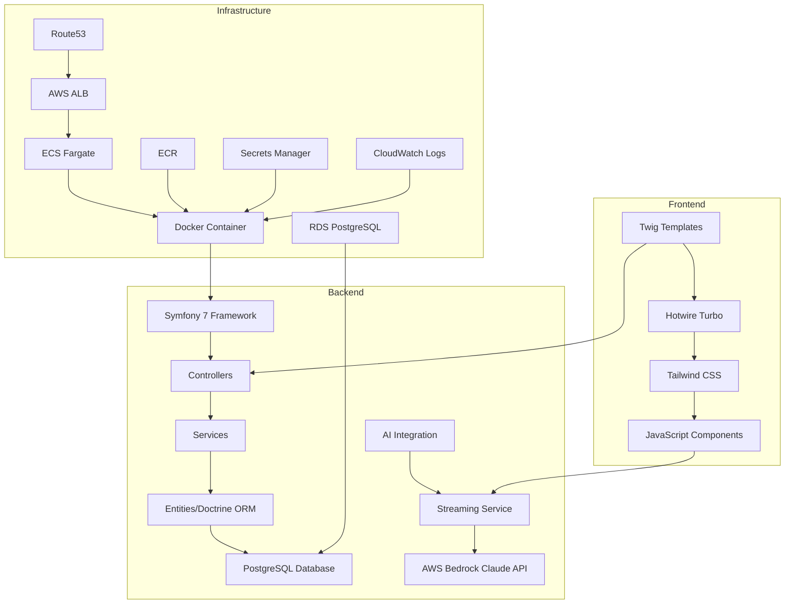

# TravelBot Architecture Overview

## System Architecture

TravelBot is a modern, AI-powered travel assistant built with Symfony 7 and deployed on AWS infrastructure. The application features real-time streaming AI conversations, travel recommendations, and a robust, scalable architecture.



## Technology Stack

### Backend Framework
- **Symfony 7.3**: Modern PHP framework with excellent DX
- **PHP 8.3**: Latest PHP version with performance improvements
- **Doctrine ORM**: Database abstraction and entity management
- **Twig**: Template engine for server-side rendering

### Frontend Technologies
- **Hotwire Turbo**: SPA-like experience without complex JavaScript
- **Tailwind CSS 4**: Utility-first CSS framework
- **Vanilla JavaScript**: Minimal, focused JavaScript for interactivity
- **Server-Sent Events (SSE)**: Real-time streaming for AI responses

### AI Integration
- **Claude AI**: Conversational AI for travel assistance via AWS Bedrock
- **Streaming API**: Real-time response delivery
- **Custom Prompting**: Travel-specific AI behavior

### Database
- **PostgreSQL 17**: Primary database for all application data
- **Doctrine Migrations**: Version-controlled database schema
- **Connection Pooling**: Optimized database connections

### Infrastructure
- **AWS ECS Fargate**: Serverless container orchestration
- **Application Load Balancer**: High availability and SSL termination
- **Route53**: DNS management with health checks
- **ECR**: Container image registry
- **Secrets Manager**: Secure credential storage
- **CloudWatch Logs**: Application and container logging

## Core Components

### 1. Entity Layer
The application uses four core entities representing the domain model:

- **User**: Authentication and user management
- **Conversation**: Chat sessions between users and AI
- **Message**: Individual messages within conversations
- **Destination**: Travel location data and recommendations

### 2. Service Layer
Business logic is encapsulated in dedicated services:

- **ChatService**: Handles AI conversation logic
- **StreamingService**: Manages real-time message delivery
- **DestinationService**: Travel recommendation engine
- **AuthenticationService**: User session management

### 3. Controller Layer
RESTful controllers handle HTTP requests:

- **ChatController**: AI conversation endpoints
- **AuthController**: Authentication flows
- **DestinationController**: Travel data API
- **HomeController**: Main application pages

### 4. Real-time Streaming
Advanced streaming implementation for AI responses:

```php
// Streaming response example
public function streamResponse(): StreamedResponse
{
    return new StreamedResponse(function() {
        while ($data = $this->aiService->getNextChunk()) {
            echo "data: " . json_encode($data) . "\n\n";
            flush();
        }
    });
}
```

## Data Flow Architecture

### 1. User Request Flow
```
User Input → Controller → Service → AI API → Streaming Response → Frontend Update
```

### 2. Database Interaction
```
Controller → Service → Repository → Doctrine ORM → PostgreSQL
```

### 3. Real-time Communication
```
Frontend JS → Server-Sent Events → Streaming Controller → AI Service → AWS Bedrock Claude API
```

## Security Architecture

### Authentication & Authorization
- **Symfony Security Component**: Robust authentication system
- **Session-based Authentication**: Secure user sessions
- **CSRF Protection**: Form security tokens
- **Input Validation**: Comprehensive data sanitization

### Infrastructure Security
- **HTTPS Everywhere**: SSL/TLS encryption for all traffic
- **VPC Isolation**: Network-level security
- **IAM Roles**: Principle of least privilege
- **Secrets Management**: No hardcoded credentials

### API Security
- **Rate Limiting**: Prevent abuse
- **Input Sanitization**: XSS/injection prevention
- **CORS Configuration**: Controlled cross-origin requests
- **Security Headers**: Comprehensive HTTP security

## Scalability Design

### Horizontal Scaling
- **ECS Auto Scaling**: Container-based scaling
- **Load Balancer**: Traffic distribution
- **Stateless Architecture**: Session-independent scaling

### Performance Optimization
- **Database Indexing**: Optimized queries
- **Connection Pooling**: Efficient database connections
- **Asset Optimization**: Minified CSS/JS
- **Caching Strategy**: Application-level caching

### Monitoring & Observability
- **CloudWatch Logs**: Centralized application logging
- **Application Logging**: Structured logging with context
- **Health Checks**: ECS and ALB health monitoring
- **Error Tracking**: Application-level error logging

## Development Architecture

### Code Organization
```
src/
├── Controller/     # HTTP request handlers
├── Entity/         # Domain models
├── Repository/     # Data access layer
├── Service/        # Business logic
├── Form/          # Form definitions
└── Security/      # Authentication logic

templates/          # Twig templates
assets/            # Frontend assets
config/            # Symfony configuration
migrations/        # Database migrations
```

### Testing Strategy
- **PHPUnit**: Configured but no tests implemented yet
- **Docker Testing**: Test environment ready for implementation
- **CI/CD Integration**: Build validation without automated tests
- **Quality Assurance**: Manual testing and code review

## Deployment Architecture

### Container Strategy
- **Multi-stage Dockerfile**: Optimized production images
- **Base Image**: PHP 8.3 FPM with Alpine Linux
- **Security Scanning**: Vulnerability detection
- **Layer Optimization**: Minimal image size

### Infrastructure as Code
- **AWS CDK**: TypeScript-based infrastructure
- **Rolling Deployment**: Zero-downtime ECS updates
- **Automated Rollback**: ECS service rollback capabilities
- **Environment Isolation**: Separate dev/staging/prod

This architecture provides a robust, scalable, and maintainable foundation for the TravelBot application, with modern development practices and production-ready infrastructure.