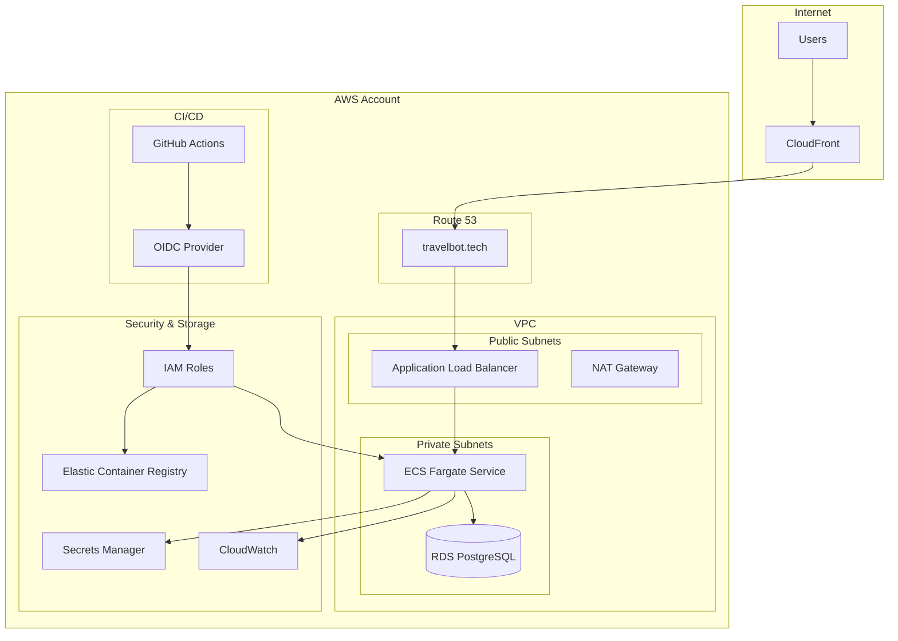

# TravelBot Infrastructure Documentation

## Overview

TravelBot infrastructure is managed using AWS CDK (Cloud Development Kit) with TypeScript, providing Infrastructure as Code (IaC) for reliable, scalable, and repeatable deployments.

## Architecture Diagram



## CDK Stack Structure

### Main Application Stack (`TravelbotStack`)

**Location**: `cdk/stacks/app.ts`

This is the primary infrastructure stack containing all application resources:

#### VPC and Networking
```typescript
// VPC with public and private subnets
const vpc = new ec2.Vpc(this, 'TravelbotVpc', {
  maxAzs: 2,
  natGateways: 1,
  subnetConfiguration: [
    {
      cidrMask: 24,
      name: 'public',
      subnetType: ec2.SubnetType.PUBLIC,
    },
    {
      cidrMask: 24,
      name: 'private',
      subnetType: ec2.SubnetType.PRIVATE_WITH_EGRESS,
    },
  ],
});
```

#### ECS Cluster and Service
```typescript
// ECS Cluster
const cluster = new ecs.Cluster(this, 'TravelbotCluster', {
  vpc,
  clusterName: 'travelbot-cluster',
});

// Task Definition
const taskDefinition = new ecs.FargateTaskDefinition(this, 'TravelbotTaskDefinition', {
  memoryLimitMiB: 1024,
  cpu: 512,
});

// Container Definition
const container = taskDefinition.addContainer('travelbot', {
  image: ecs.ContainerImage.fromEcrRepository(ecrRepository),
  logging: ecs.LogDrivers.awsLogs({
    streamPrefix: 'travelbot',
    logRetention: logs.RetentionDays.ONE_WEEK,
  }),
  environment: {
    APP_ENV: 'prod',
    DATABASE_URL: databaseUrl,
  },
  secrets: {
    OPENAI_API_KEY: ecs.Secret.fromSecretsManager(openaiSecret),
  },
});
```

#### Application Load Balancer
```typescript
const loadBalancer = new elbv2.ApplicationLoadBalancer(this, 'TravelbotALB', {
  vpc,
  internetFacing: true,
  securityGroup: albSecurityGroup,
});

// HTTPS Listener
const httpsListener = loadBalancer.addListener('HttpsListener', {
  port: 443,
  certificates: [certificate],
  defaultAction: elbv2.ListenerAction.forward([targetGroup]),
});

// HTTP Redirect
loadBalancer.addListener('HttpListener', {
  port: 80,
  defaultAction: elbv2.ListenerAction.redirect({
    protocol: 'HTTPS',
    port: '443',
    permanent: true,
  }),
});
```

#### RDS Database
```typescript
const database = new rds.DatabaseInstance(this, 'TravelbotDatabase', {
  engine: rds.DatabaseInstanceEngine.postgres({
    version: rds.PostgresEngineVersion.VER_17,
  }),
  instanceType: ec2.InstanceType.of(ec2.InstanceClass.T3, ec2.InstanceSize.MICRO),
  vpc,
  vpcSubnets: {
    subnetType: ec2.SubnetType.PRIVATE_WITH_EGRESS,
  },
  databaseName: 'travelbot',
  credentials: rds.Credentials.fromGeneratedSecret('postgres'),
  backupRetention: cdk.Duration.days(7),
  deletionProtection: true,
});
```

### GitHub OIDC Stack (`TravelbotGitHubOidcStack`)

**Location**: `cdk/stacks/github-oidc.ts`

Separate stack for GitHub Actions authentication:

```typescript
// OIDC Provider
const githubProvider = new iam.OpenIdConnectProvider(this, 'GitHubOidcProvider', {
  url: 'https://token.actions.githubusercontent.com',
  clientIds: ['sts.amazonaws.com'],
  thumbprints: ['6938fd4d98bab03faadb97b34396831e3780aea1'],
});

// GitHub Actions Role
const githubRole = new iam.Role(this, 'GitHubActionsRole', {
  assumedBy: new iam.WebIdentityPrincipal(githubProvider.openIdConnectProviderArn, {
    StringEquals: {
      'token.actions.githubusercontent.com:aud': 'sts.amazonaws.com',
    },
    StringLike: {
      'token.actions.githubusercontent.com:sub': `repo:${repositoryName}:*`,
    },
  }),
});
```

## Security Configuration

### IAM Roles and Policies

#### ECS Task Role
```typescript
const taskRole = new iam.Role(this, 'TravelbotTaskRole', {
  assumedBy: new iam.ServicePrincipal('ecs-tasks.amazonaws.com'),
  managedPolicies: [
    iam.ManagedPolicy.fromAwsManagedPolicyName('service-role/AmazonECSTaskExecutionRolePolicy'),
  ],
});

// Secrets Manager access
taskRole.addToPolicy(new iam.PolicyStatement({
  effect: iam.Effect.ALLOW,
  actions: [
    'secretsmanager:GetSecretValue',
  ],
  resources: [openaiSecret.secretArn],
}));
```

#### GitHub Actions Permissions
```typescript
githubRole.addToPolicy(new iam.PolicyStatement({
  effect: iam.Effect.ALLOW,
  actions: [
    'ecr:GetAuthorizationToken',
    'ecr:BatchCheckLayerAvailability',
    'ecr:GetDownloadUrlForLayer',
    'ecr:BatchGetImage',
    'ecr:PutImage',
    'ecr:InitiateLayerUpload',
    'ecr:UploadLayerPart',
    'ecr:CompleteLayerUpload',
  ],
  resources: ['*'],
}));
```

### Security Groups

#### ALB Security Group
```typescript
const albSecurityGroup = new ec2.SecurityGroup(this, 'AlbSecurityGroup', {
  vpc,
  description: 'Security group for Application Load Balancer',
  allowAllOutbound: true,
});

albSecurityGroup.addIngressRule(
  ec2.Peer.anyIpv4(),
  ec2.Port.tcp(80),
  'Allow HTTP traffic'
);

albSecurityGroup.addIngressRule(
  ec2.Peer.anyIpv4(),
  ec2.Port.tcp(443),
  'Allow HTTPS traffic'
);
```

#### ECS Security Group
```typescript
const ecsSecurityGroup = new ec2.SecurityGroup(this, 'EcsSecurityGroup', {
  vpc,
  description: 'Security group for ECS tasks',
});

ecsSecurityGroup.addIngressRule(
  albSecurityGroup,
  ec2.Port.tcp(80),
  'Allow traffic from ALB'
);
```

#### Database Security Group
```typescript
const dbSecurityGroup = new ec2.SecurityGroup(this, 'DatabaseSecurityGroup', {
  vpc,
  description: 'Security group for RDS database',
});

dbSecurityGroup.addIngressRule(
  ecsSecurityGroup,
  ec2.Port.tcp(5432),
  'Allow PostgreSQL access from ECS'
);
```

## Monitoring and Logging

### CloudWatch Configuration

#### Application Logs
```typescript
const logGroup = new logs.LogGroup(this, 'TravelbotLogGroup', {
  logGroupName: '/aws/ecs/travelbot',
  retention: logs.RetentionDays.ONE_WEEK,
  removalPolicy: cdk.RemovalPolicy.DESTROY,
});
```

#### Metrics and Alarms
```typescript
// High CPU utilization alarm
const cpuAlarm = new cloudwatch.Alarm(this, 'HighCpuAlarm', {
  metric: service.metricCpuUtilization(),
  threshold: 80,
  evaluationPeriods: 3,
  treatMissingData: cloudwatch.TreatMissingData.NOT_BREACHING,
});

// Memory utilization alarm
const memoryAlarm = new cloudwatch.Alarm(this, 'HighMemoryAlarm', {
  metric: service.metricMemoryUtilization(),
  threshold: 80,
  evaluationPeriods: 3,
});
```

#### Dashboard
```typescript
const dashboard = new cloudwatch.Dashboard(this, 'TravelbotDashboard', {
  dashboardName: 'TravelBot-Monitoring',
  widgets: [
    [
      new cloudwatch.GraphWidget({
        title: 'ECS CPU and Memory Utilization',
        left: [service.metricCpuUtilization()],
        right: [service.metricMemoryUtilization()],
      }),
    ],
    [
      new cloudwatch.GraphWidget({
        title: 'ALB Request Count and Target Response Time',
        left: [loadBalancer.metricRequestCount()],
        right: [targetGroup.metricTargetResponseTime()],
      }),
    ],
  ],
});
```

## SSL/TLS Configuration

### Certificate Management
```typescript
// Route53 Hosted Zone
const hostedZone = route53.HostedZone.fromLookup(this, 'HostedZone', {
  domainName: 'travelbot.tech',
});

// SSL Certificate
const certificate = new acm.Certificate(this, 'TravelbotCertificate', {
  domainName: 'travelbot.tech',
  subjectAlternativeNames: ['*.travelbot.tech'],
  validation: acm.CertificateValidation.fromDns(hostedZone),
});
```

### DNS Configuration
```typescript
// A Record for main domain
new route53.ARecord(this, 'TravelbotARecord', {
  zone: hostedZone,
  recordName: 'travelbot.tech',
  target: route53.RecordTarget.fromAlias(
    new route53Targets.LoadBalancerTarget(loadBalancer)
  ),
});

// CNAME for www
new route53.CnameRecord(this, 'WwwCnameRecord', {
  zone: hostedZone,
  recordName: 'www',
  domainName: 'travelbot.tech',
});
```

## Auto Scaling Configuration

### ECS Service Auto Scaling
```typescript
const scalableTarget = service.autoScaleTaskCount({
  minCapacity: 1,
  maxCapacity: 10,
});

// CPU-based scaling
scalableTarget.scaleOnCpuUtilization('CpuScaling', {
  targetUtilizationPercent: 50,
  scaleInCooldown: cdk.Duration.minutes(5),
  scaleOutCooldown: cdk.Duration.minutes(2),
});

// Memory-based scaling
scalableTarget.scaleOnMemoryUtilization('MemoryScaling', {
  targetUtilizationPercent: 50,
  scaleInCooldown: cdk.Duration.minutes(5),
  scaleOutCooldown: cdk.Duration.minutes(2),
});
```

## Deployment Strategy

### Blue/Green Deployment
The ECS service uses rolling updates with the following configuration:

```typescript
const service = new ecs.FargateService(this, 'TravelbotService', {
  cluster,
  taskDefinition,
  desiredCount: 1,
  assignPublicIp: false,
  securityGroups: [ecsSecurityGroup],
  vpcSubnets: {
    subnetType: ec2.SubnetType.PRIVATE_WITH_EGRESS,
  },
  deploymentConfiguration: {
    maximumPercent: 200,
    minimumHealthyPercent: 50,
  },
  healthCheckGracePeriod: cdk.Duration.seconds(60),
});
```

### Health Checks
```typescript
// ALB Target Group Health Check
const targetGroup = new elbv2.ApplicationTargetGroup(this, 'TravelbotTargetGroup', {
  vpc,
  port: 80,
  protocol: elbv2.ApplicationProtocol.HTTP,
  targets: [service],
  healthCheck: {
    path: '/health',
    healthyHttpCodes: '200',
    interval: cdk.Duration.seconds(30),
    timeout: cdk.Duration.seconds(5),
    unhealthyThresholdCount: 3,
    healthyThresholdCount: 2,
  },
});
```

## Backup and Disaster Recovery

### Database Backups
```typescript
const database = new rds.DatabaseInstance(this, 'TravelbotDatabase', {
  // ... other configuration
  backupRetention: cdk.Duration.days(7),
  deleteAutomatedBackups: false,
  deletionProtection: true,
  multiAz: false, // Enable for production
});
```

### Secrets Backup
```typescript
// Automatic rotation for database credentials
const databaseSecret = new secretsmanager.Secret(this, 'DatabaseSecret', {
  description: 'Database credentials for TravelBot',
  generateSecretString: {
    secretStringTemplate: JSON.stringify({ username: 'postgres' }),
    generateStringKey: 'password',
    excludeCharacters: '"@/\\',
  },
});
```

## Cost Optimization

### Resource Tagging
```typescript
// Apply tags to all resources
cdk.Tags.of(this).add('Project', 'TravelBot');
cdk.Tags.of(this).add('Environment', 'production');
cdk.Tags.of(this).add('Owner', 'devops-team');
cdk.Tags.of(this).add('CostCenter', 'engineering');
```

### Right-Sizing
- **ECS Tasks**: 512 CPU, 1024MB memory for cost efficiency
- **RDS**: t3.micro instance for development/testing
- **NAT Gateway**: Single NAT gateway for cost savings
- **Log Retention**: 1 week to minimize storage costs

## Environment Management

### Development Environment
```typescript
// Smaller resources for development
if (environmentName === 'development') {
  taskDefinition = new ecs.FargateTaskDefinition(this, 'TaskDefinition', {
    memoryLimitMiB: 512,
    cpu: 256,
  });
  
  database = new rds.DatabaseInstance(this, 'Database', {
    instanceType: ec2.InstanceType.of(ec2.InstanceClass.T3, ec2.InstanceSize.MICRO),
    deletionProtection: false,
  });
}
```

### Production Environment
```typescript
// Enhanced resources for production
if (environmentName === 'production') {
  taskDefinition = new ecs.FargateTaskDefinition(this, 'TaskDefinition', {
    memoryLimitMiB: 2048,
    cpu: 1024,
  });
  
  database = new rds.DatabaseInstance(this, 'Database', {
    instanceType: ec2.InstanceType.of(ec2.InstanceClass.T3, ec2.InstanceSize.SMALL),
    multiAz: true,
    deletionProtection: true,
  });
}
```

## Deployment Commands

### Bootstrap CDK
```bash
# First-time setup
npx cdk bootstrap aws://ACCOUNT-ID/REGION

# With specific profile
npx cdk bootstrap aws://ACCOUNT-ID/REGION --profile production
```

### Deploy Infrastructure
```bash
# Deploy all stacks
npx cdk deploy --all

# Deploy specific stack
npx cdk deploy TravelbotStack

# Deploy with approval
npx cdk deploy --require-approval never

# Deploy to specific environment
npx cdk deploy TravelbotStack --context environment=production
```

### Infrastructure Validation
```bash
# Synthesize CloudFormation templates
npx cdk synth

# Check differences
npx cdk diff

# List all stacks
npx cdk list
```

This infrastructure provides a robust, scalable, and secure foundation for the TravelBot application with proper monitoring, security, and cost optimization considerations.