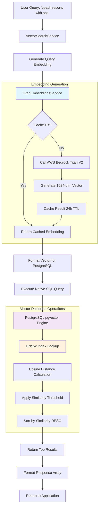
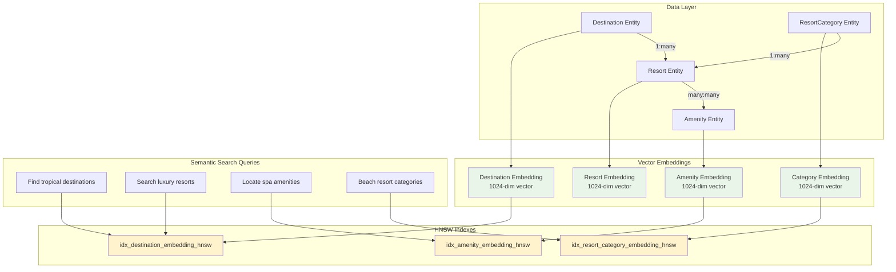
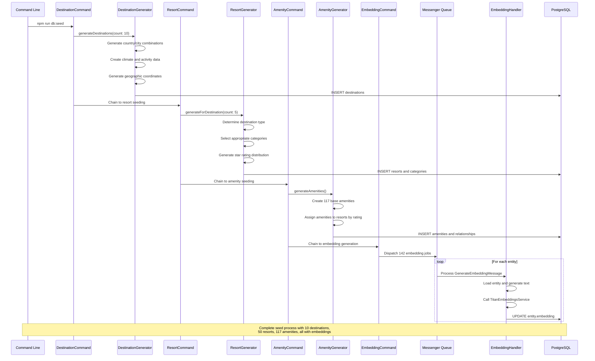
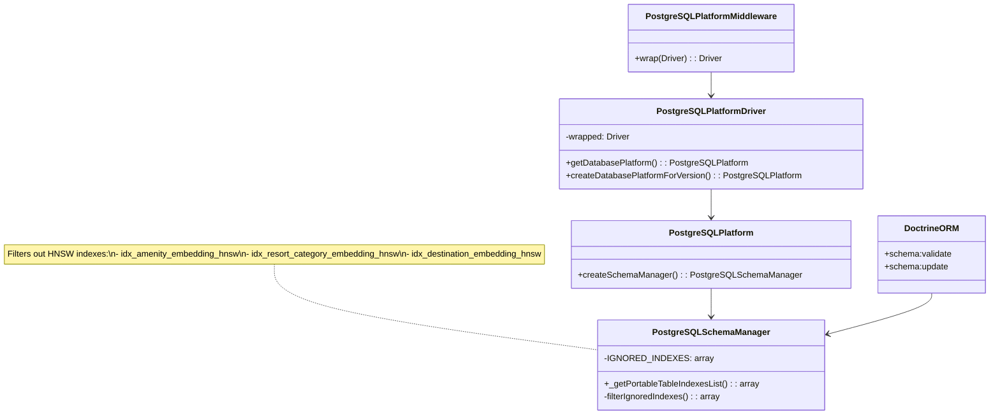
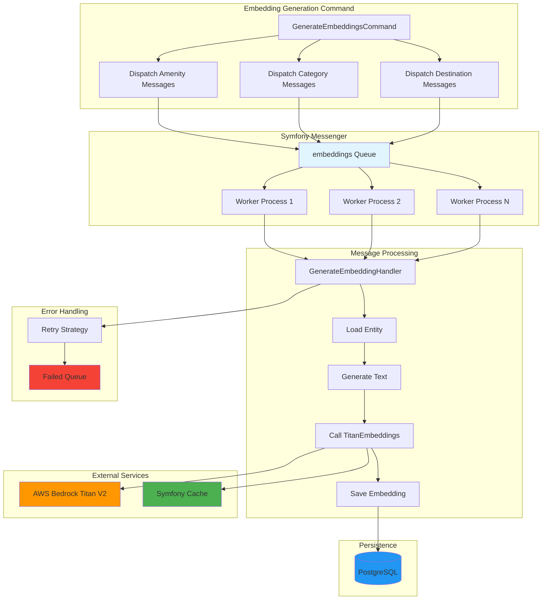
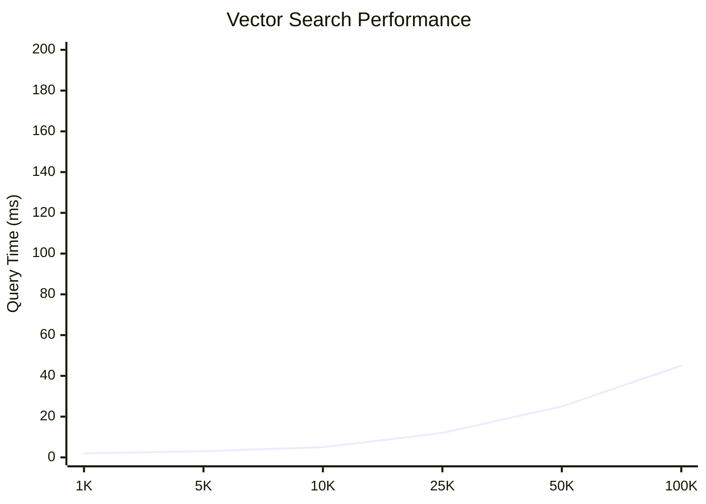
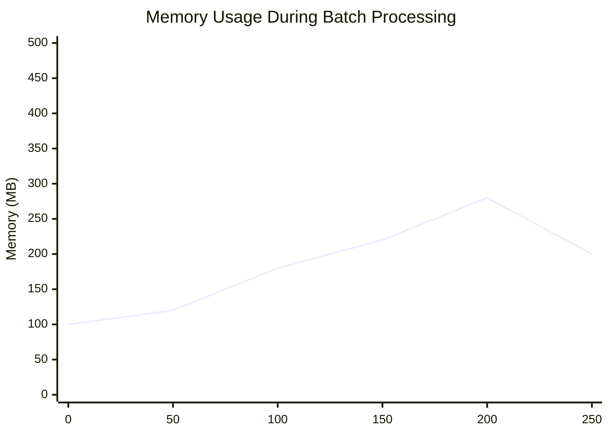

# Technical Diagrams and Deep Dive

## Vector Search Query Flow



## Entity Relationship Flow with Vector Connections



## Seed System Data Generation Pipeline



## Vector Similarity Mathematics

### Cosine Distance Calculation

```mermaid
graph LR
    A[Vector A<br/>1024 dimensions] --> C[Dot Product<br/>A • B]
    B[Vector B<br/>1024 dimensions] --> C
    
    A --> D[Magnitude ||A||<br/>√(a₁² + a₂² + ... + a₁₀₂₄²)]
    B --> E[Magnitude ||B||<br/>√(b₁² + b₂² + ... + b₁₀₂₄²)]
    
    C --> F[Cosine Similarity<br/>(A • B) / (||A|| × ||B||)]
    D --> F
    E --> F
    
    F --> G[Cosine Distance<br/>1 - Cosine Similarity]
    
    G --> H[PostgreSQL Query<br/>1 - (embedding <=> query::vector)]
    
    style F fill:#e1f5fe
    style G fill:#f3e5f5
    style H fill:#fff3e0
```

### Mathematical Properties

**Vector Space Properties:**
- **Dimension**: 1024 (Titan V2 embedding size)
- **Range**: Each dimension typically [-1, 1] after normalization
- **Distance Metric**: Cosine distance ∈ [0, 1]
- **Similarity Interpretation**: 
  - 0.9-1.0: Nearly identical semantic meaning
  - 0.7-0.9: Strong semantic similarity
  - 0.5-0.7: Moderate similarity
  - 0.3-0.5: Weak similarity
  - 0.0-0.3: Little to no similarity

**HNSW Algorithm Benefits:**
- **Complexity**: O(log N) average search time
- **Accuracy**: 95%+ recall for top-k results
- **Memory**: ~1.5x storage overhead
- **Parallelization**: Inherently parallel search

## Middleware Architecture for Index Management



## Async Embedding Processing Architecture



## Performance Characteristics

### Query Performance by Dataset Size



### Memory Usage During Embedding Generation



## Database Schema with Vector Columns

```sql
-- Core entity with vector embedding
CREATE TABLE destination (
    id UUID PRIMARY KEY DEFAULT gen_random_uuid(),
    name VARCHAR(255) NOT NULL,
    country VARCHAR(100) NOT NULL,
    city VARCHAR(100),
    description TEXT,
    tags JSONB,
    climate JSONB,
    average_cost_per_day VARCHAR(20),
    activities JSONB,
    best_months_to_visit JSONB,
    latitude DECIMAL(10, 8),
    longitude DECIMAL(11, 8),
    image_url TEXT,
    popularity_score INTEGER DEFAULT 5,
    embedding vector(1024), -- pgvector column
    created_at TIMESTAMP NOT NULL DEFAULT NOW(),
    updated_at TIMESTAMP NOT NULL DEFAULT NOW()
);

-- HNSW index for fast similarity search
CREATE INDEX idx_destination_embedding_hnsw 
ON destination USING hnsw (embedding vector_cosine_ops);

-- GIN index for JSONB columns
CREATE INDEX idx_destination_tags ON destination USING gin (tags);
CREATE INDEX idx_destination_activities ON destination USING gin (activities);

-- Geographic indexes
CREATE INDEX idx_destination_location ON destination (latitude, longitude);
CREATE INDEX idx_destination_country ON destination (country);
```

## Vector Search Query Examples

### Basic Similarity Search
```sql
-- Find destinations similar to "tropical beach paradise"
SELECT 
    d.name,
    d.country,
    d.tags,
    (1 - (d.embedding <=> '[0.1,0.2,0.3,...]'::vector)) as similarity
FROM destination d
WHERE d.embedding IS NOT NULL
  AND (1 - (d.embedding <=> '[0.1,0.2,0.3,...]'::vector)) >= 0.7
ORDER BY similarity DESC
LIMIT 10;
```

### Complex Multi-Entity Search
```sql
-- Find beach resorts with specific amenities
WITH similar_categories AS (
    SELECT rc.id, rc.name,
           (1 - (rc.embedding <=> :beach_embedding::vector)) as cat_similarity
    FROM resort_category rc
    WHERE rc.embedding IS NOT NULL
      AND (1 - (rc.embedding <=> :beach_embedding::vector)) >= 0.7
), similar_amenities AS (
    SELECT a.id, a.name,
           (1 - (a.embedding <=> :spa_embedding::vector)) as amenity_similarity
    FROM amenity a
    WHERE a.embedding IS NOT NULL
      AND (1 - (a.embedding <=> :spa_embedding::vector)) >= 0.6
)
SELECT DISTINCT
    r.id,
    r.name,
    r.star_rating,
    d.name as destination,
    sc.name as category,
    array_agg(sa.name) as matching_amenities,
    avg(sc.cat_similarity) as category_match,
    avg(sa.amenity_similarity) as amenity_match
FROM resort r
JOIN destination d ON r.destination_id = d.id
JOIN similar_categories sc ON r.category_id = sc.id
JOIN resort_amenity ra ON r.id = ra.resort_id
JOIN similar_amenities sa ON ra.amenity_id = sa.id
GROUP BY r.id, r.name, r.star_rating, d.name, sc.name
HAVING count(sa.id) >= 2  -- At least 2 matching amenities
ORDER BY category_match DESC, amenity_match DESC, r.star_rating DESC
LIMIT 15;
```

### Geographic + Semantic Search
```sql
-- Find family destinations in Europe with high similarity
SELECT 
    d.name,
    d.country,
    d.city,
    d.tags,
    ST_Distance(
        ST_Point(d.longitude, d.latitude)::geography,
        ST_Point(2.3522, 48.8566)::geography  -- Distance from Paris
    ) / 1000 as distance_km,
    (1 - (d.embedding <=> :family_embedding::vector)) as similarity,
    CASE 
        WHEN d.tags @> '["family-friendly"]'::jsonb THEN 1.0
        ELSE 0.0 
    END as tag_bonus
FROM destination d
WHERE d.embedding IS NOT NULL
  AND d.latitude BETWEEN 35.0 AND 70.0  -- Europe bounds
  AND d.longitude BETWEEN -10.0 AND 40.0
  AND (
      (1 - (d.embedding <=> :family_embedding::vector)) >= 0.6
      OR d.tags @> '["family-friendly"]'::jsonb
  )
ORDER BY 
    tag_bonus DESC,
    similarity DESC,
    distance_km ASC
LIMIT 20;
```

This technical deep-dive provides the mathematical foundation and implementation details necessary to understand and extend the vector search system.